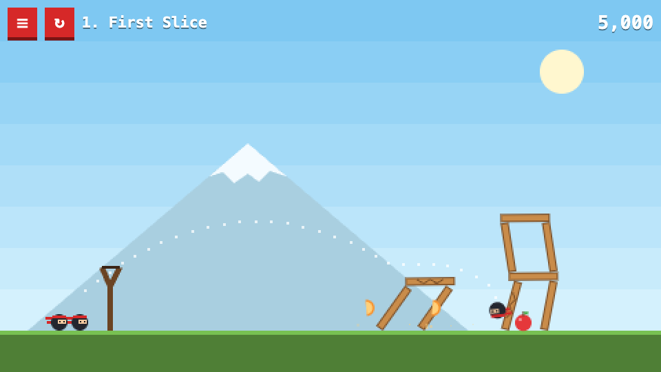

# Angry Ninjas

Fling ninjas from a slingshot and slice every fruit. A small physics game in a chunky pixel style. You can install it as an app, and it works offline.

**Play:** https://octanexus.github.io/fun-projects/angry-ninjas/



## How to play

- Drag anywhere on the screen to pull the slingshot back, then let go.
- Fruit gets sliced when something hits it hard enough: a ninja, a falling block or a fall.
- Wood breaks easily, ice breaks very easily, and stone takes a solid hit.
- Clear every fruit to finish the level. Each ninja you don't use is worth 10,000 points.

There are six levels:

1. **First Slice**
2. **Thin Ice**
3. **Stone Temple**
4. **Mad Tea Party**: Alice in Wonderland, with a Cheshire grin, giant mushrooms and a checkerboard floor.
5. **Chocolate River**: a chocolate factory, with a chocolate waterfall, lollipop trees and candy grass.
6. **Gatsby's Party**: The Great Gatsby (2013 film style), with an art-deco mansion, fireworks and the green light across the bay.

## Install

Open the play link, then:

- **Chrome / Edge / Android:** choose *Install app* (in the address bar or the menu).
- **iPhone / iPad (Safari):** tap Share, then *Add to Home Screen*.

Once it has loaded one time, it runs without a connection.

## Run locally

Any static file server works, for example:

```sh
cd angry-ninjas
python3 -m http.server 8000
# open http://localhost:8000
```

## Files

| File | What it does |
| --- | --- |
| `sim.js` | Levels, physics setup, damage and turn rules. Has no DOM code, so it also runs in Node. |
| `main.js` | Drawing, input, menus and saved best scores. |
| `index.html`, `style.css` | Page and UI. |
| `manifest.webmanifest`, `sw.js`, `icons/` | Installable app and offline support. |
| `lib/matter.min.js` | [Matter.js](https://brm.io/matter-js/) 0.20.0 physics engine (MIT license). |

When you change any file, also bump `CACHE` in `sw.js`. Otherwise installed copies keep serving the old version.

To add a level, add an entry to `LEVELS` in `sim.js`. Each block is `[material, shape, x, bottom]` and each fruit is `[type, x, bottom]`. Positions are in the 480×270 screen's pixels, and `bottom` is the height above the ground.
